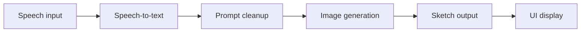

# sketchAI - Voice-to-Sketch Generation Assistant

[](https://siddhantdamre.github.io/sketchAI/)
[](https://github.com/Siddhantdamre/Siddhantdamre/blob/main/PORTFOLIO.md)
[](LICENSE)

sketchAI is a multimodal AI assistant that turns speech or text prompts into generated sketch-style images. It combines voice capture, speech-to-text, prompt processing, Hugging Face image generation, and a lightweight UI flow.

## Recruiter Quick Look

| What to check | Why it matters |
| --- | --- |
| [Live surface](https://siddhantdamre.github.io/sketchAI/) | Quick overview of the product concept and demo plan. |
| `speech_capture.py`, `speech_to_text.py` | Voice input pipeline. |
| `text_processing.py`, `text_analysis.py` | Prompt preparation and analysis. |
| `generate_sketch.py`, `generate_face_sketch.py` | Image/sketch generation path. |
| `ui_display.py`, `main.py` | End-to-end application flow. |
| `docs/DEMO_ROADMAP.md` | Plan for a hosted Hugging Face Spaces demo. |

## Problem

Text-to-image tools often start from typed prompts. sketchAI explores a more natural creative workflow: speak an idea, clean it into a useful prompt, generate a sketch, and show the result in a small app surface.

## Architecture



## Tech Stack

`Python` `Hugging Face` `Speech Recognition` `Prompt Processing` `Image Generation` `UI Display`

## Setup

Create an environment variable for Hugging Face access:

```bash
set HUGGINGFACE_API_TOKEN=your_token_here
```

On macOS/Linux:

```bash
export HUGGINGFACE_API_TOKEN=your_token_here
```

Then run the main app flow:

```bash
python main.py
```

Do not commit API keys or tokens. If an old token was ever exposed, rotate it before deploying.

## Current Demo State

The GitHub Pages surface explains the product and architecture. The next strong version is a Hugging Face Spaces or Gradio app where reviewers can type a prompt, optionally use a sample voice transcript, and see generated sketch outputs.

## Roadmap

- Add a Hugging Face Spaces demo with safe sample prompts.
- Add example generated images under `examples/`.
- Add fallback mock generation for reviewers without API keys.
- Add a short GIF showing voice prompt to generated sketch.
- Add clearer model/provider configuration in `.env.example`.

## License

MIT
